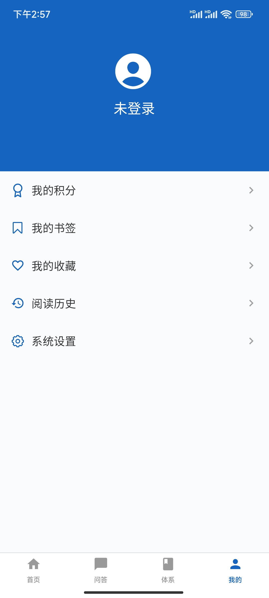
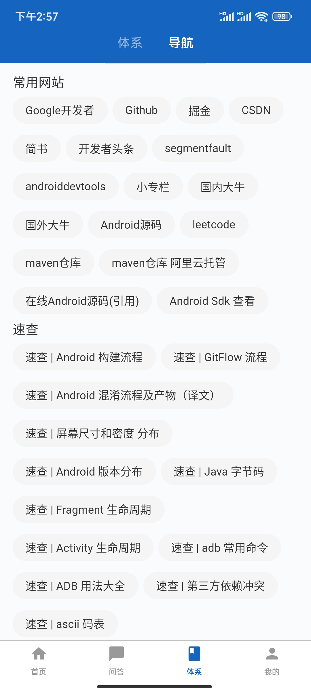
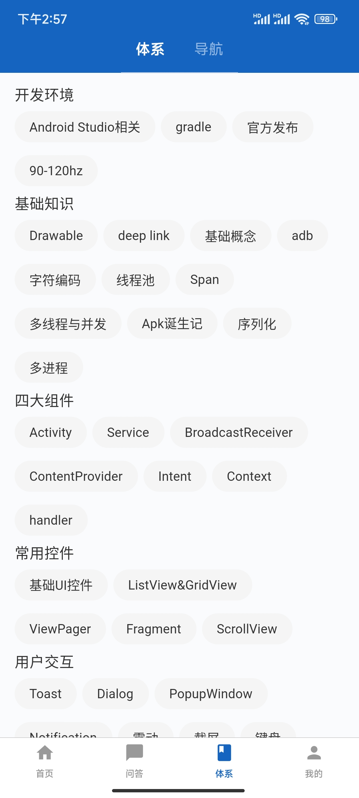
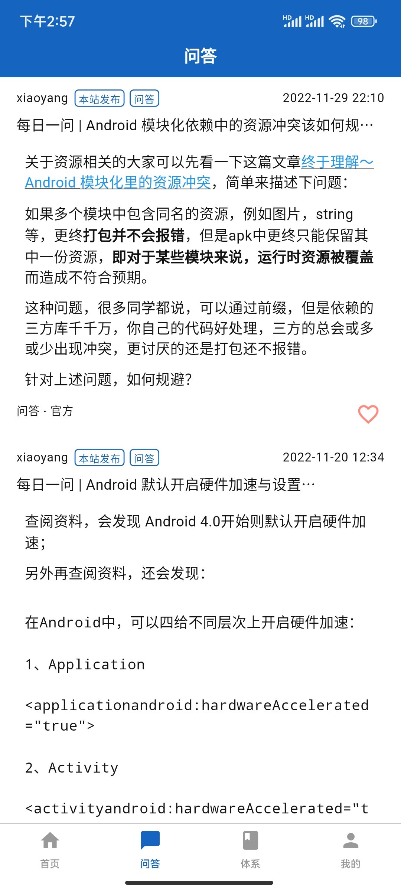
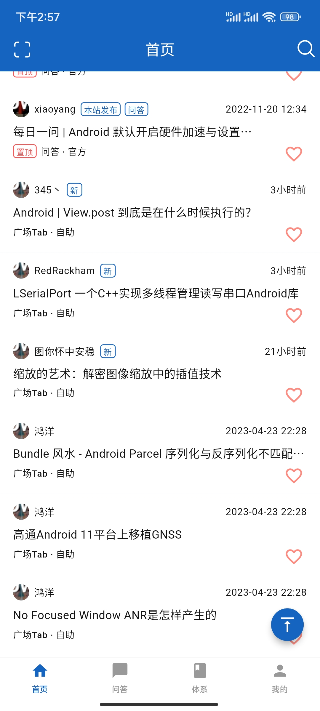
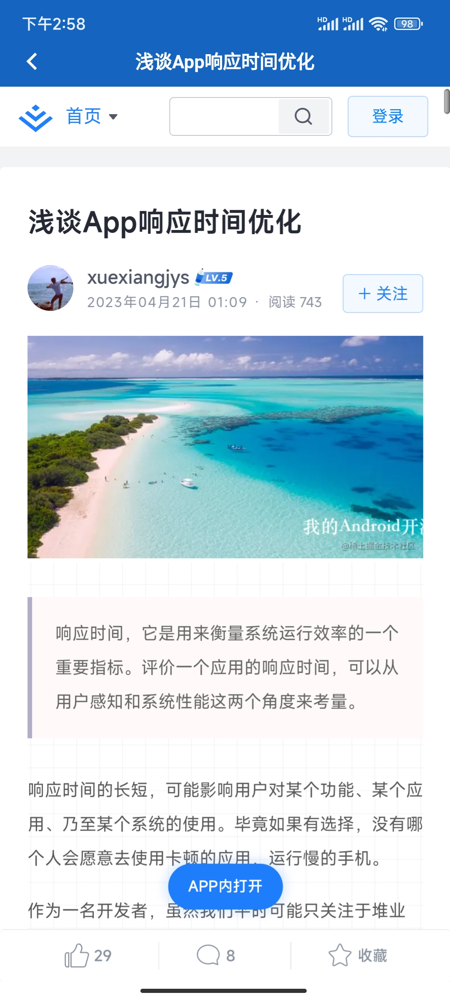

# WanAndroid

flutter 版本的WanAndroid。项目主要开发了引导页、首页、问答、体系、我的、阅读历史、搜索、二维码扫描、登录注册（未调接口），体系列表等页面。项目整体风格采用Material3。


### 开发环境

> 当前flutter版本

```markdown
Flutter 3.7.6 • channel stable • https://github.com/flutter/flutter.git
Framework • revision 12cb4eb7a0 (8 weeks ago) • 2023-03-01 10:29:26 -0800
Engine • revision ada363ee93
Tools • Dart 2.19.3 • DevTools 2.20.1

```

> Android
>
> ```markdown
> gradle:7.5
> gralde tools:7.2.0
> ```

### 项目架构

项目整体使用MVVM架构模式，使用Getx包进行状态管理、路由和依赖注入（绑定）。网络请求使用的Dio,部分页面使用get-connect。遵循 GetX 推荐的文件夹结构。


**ViewModel**： 首先让我们谈谈ViewModel。实际上视图模型是我们实现业务逻辑的控制器。它从模型接收数据并根据业务逻辑处理数据并推送到通过视图观察的实时数据观察者。

**视图**：视图是文本、图像、下拉列表等小部件的集合，将显示给用户。即使它控制用户输入。当它需要任何数据时，它会命令视图模型（在这个项目中是控制器）获取数据并观察响应。到那时它可能会向用户显示加载程序。

**模型**：模型基本上是后端逻辑。它控制数据源。


**APP 整体结构**

    - flutter_arch. App架构包，可复用。
    _ app_data。 App数据包，多个业务app共用。
    _ app_widget。 App widget包，多个业务app共用
    - app。WanAndroid 项目主体。

**APP 目录结构**

    -lib
    	|-- src
    		|-- base   基于架构
    		|-- bindings 依赖注入
    		|-- data   数据源：网络请求(dio,get-connect)，本地数据（sqlte3,floor）
    		|-- middleware 中间件。
    		|-- page	相关页面
    		|-- routes	route
    		|-- service	应用程序生命周期内持久化类实例
    		|-- utils   项目相关工具类
    		|-- widget	widget
    		app.dart
    	main_dev.dart
    	main_prod.dart


**其他**

*   数据存储。项目中用到SP，GetStorage,sqlte3,floor类似Room,阅读历史用的是foor.
*   主体和语言切换。使用Getx。
*   json。 json\_serializable
*   屏幕适配。flutter\_screenutil
*   日志。logger
*   国际化相关。flutter\_localizations


### App截图
   


  

### 下载

*   Android 打包;

    > &#x20;flutter build apk --release --target=lib/main\_dev.dart

    [下载地址](https://www.pgyer.com/f2nL) 


    密码：12345
* IOS 运行源代码

> 开源不易

        


### 感谢

1.  感谢鸿洋大佬提供的[开源api](http://www.wanandroid.com/blog/show/2)
2.  [页面参考](https://github.com/goweii/WanAndroid)
3.  <https://github.com/ducafecat/flutter_ducafecat_news_getx>
4.  <https://github.com/hasancse91/flutter_getx_template>


